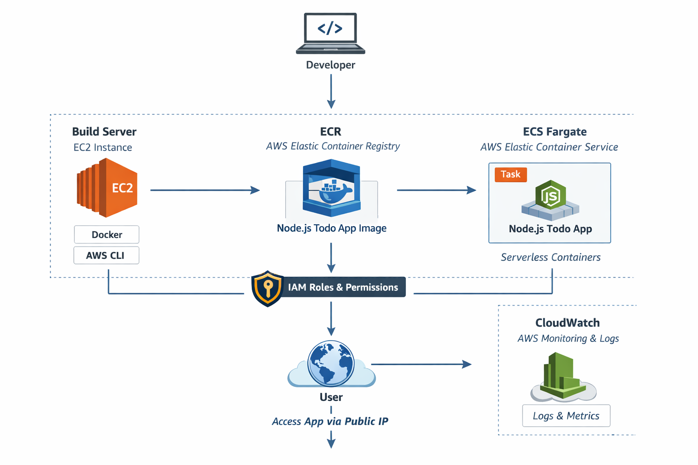

# 🚀 Node.js Todo App Deployment using ECS, ECR & CloudWatch

## 📌 Project Overview
This project demonstrates how to containerize a Node.js Todo application and deploy it on a serverless infrastructure using AWS services.

The application is built using Docker, stored in ECR, and deployed using ECS Fargate. Logs are monitored using CloudWatch.

---

## 🧰 Tech Stack

- Node.js
- Docker
- AWS EC2 (Build Server)
- AWS ECR
- AWS ECS (Fargate)
- AWS CloudWatch
- AWS IAM
- GitHub

---

## 🏗️ Architecture

---

## 🏗️ App Output

- Access app via browser  
- `http://<public-ip>:8000`

---

## 📘 Detailed Documentation
👉 [Click here for full step-by-step guide](docs/project-details.md)
