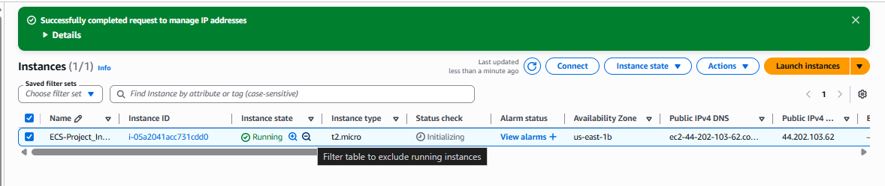
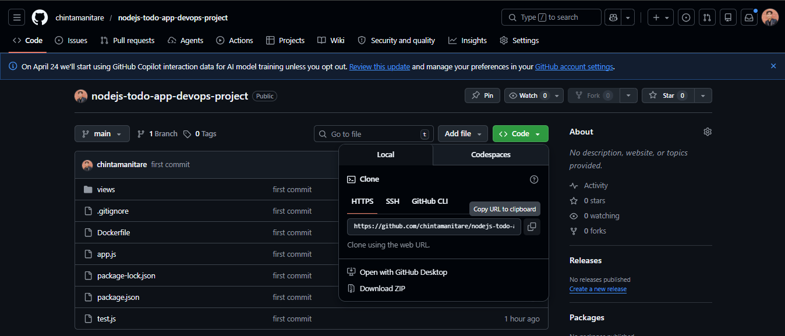
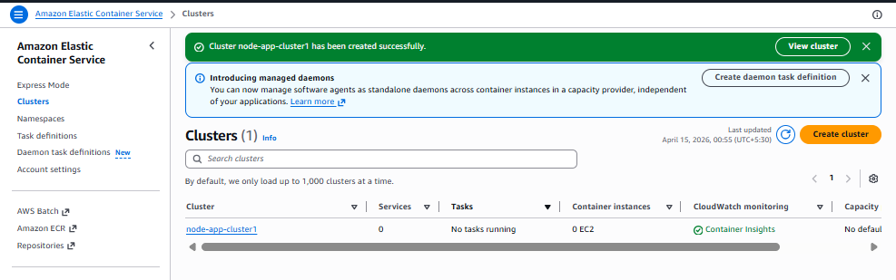
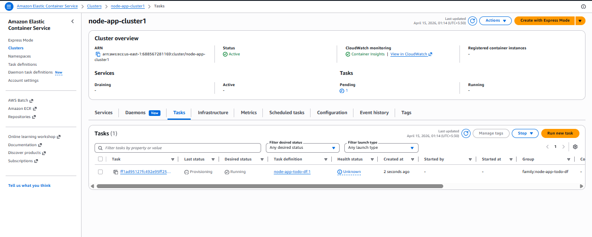
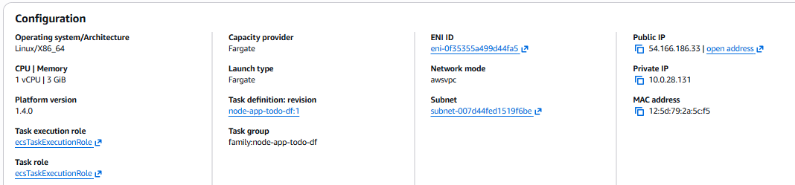
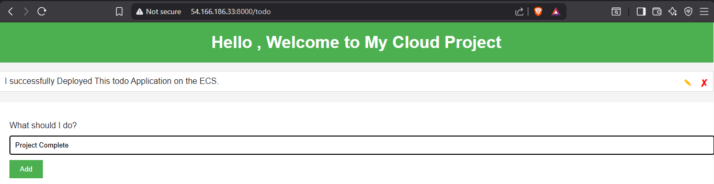
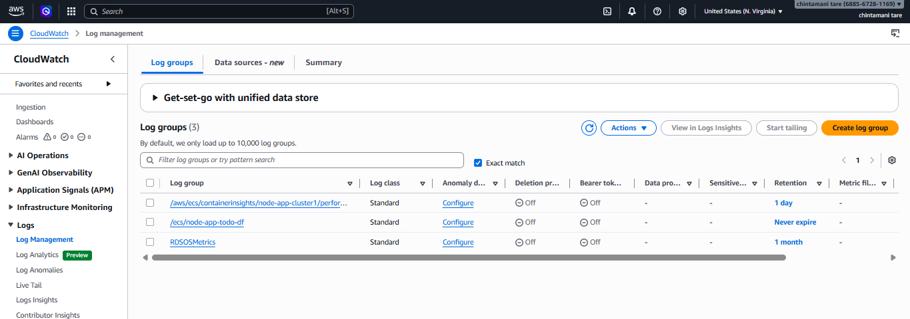

---

## ⚙️ Step-by-Step Implementation

### 🔹 Step 1: EC2 Setup

- Launch Ubuntu EC2
  

- Clone Github Code

- Install Docker & AWS CLI

- Create AWS USER & Credentials

- Configure AWS

---

### 🔹 Step 2: ECR Setup

- Create ECR repository

- Login & push Docker image

---

### 🔹 Step 3: ECS Configuration

- Create ECS Cluster (Fargate)

- Create Task Definition

---

### 🔹 Step 4: Running Task

- Run task in ECS

- Assign public IP

---

### 🔹 Step 5: Application Output

- Access app via browser
- `http://<public-ip>:8000`

---

### 🔹 Step 6: CloudWatch Logs

- Monitor logs in CloudWatch  
- Log group: `/ecs/node-app`

---

## 🎯 Outcome

- Successfully deployed a containerized Node.js app
- Implemented serverless deployment using ECS Fargate
- Monitored logs using CloudWatch

---

